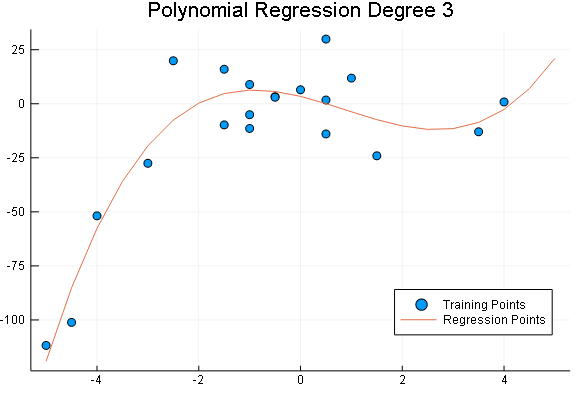

# MachineLearning.jl


## Introduction.
This package is being designed among others to provide Petroleum Engineering tools in a modern programming language. This package is part of the project 7G which  proposes to make basic but powerful engineering software packages that cover the main topics of the Oil and Gas development phases which could be applied to any case study by suitable engineers.

There are five topics in which the project is going to be focused on:

<br>-Geoscience
<br>-Reservoir
<br>-Production
<br>-Economics
<br>-Integration(Current Package)

<br> The package will always be in permanent development and open to suggestions to enhance the program. As the code has been written so far by a code enthusiastic Petroleum Engineer I hope to learn as much as possible to get better and useful programs.

## MachineLearning.jl Description
MachineLearning.jl is a package that allows to apply in a easy-to-use way basic Machine Learning algorithms such as Supervised and Unsupervised Learning

The algorithms written in this packages are described by Andrew Ng in the Online course "Machine Learning".

## Examples

### Linear Regression
A simple linear regression can be performed by using algorithms that estimates the Cost Function and its gradient whose output values can be handled by a robust optimizer (Optim.jl Package).

```julia
D=CSV.read("Data.csv");
X=D.x
Y=D.y
plot(X,Y, xlabel="X Data", ylabel="Y Data", title="Data Points Example", seriestype=:scatter, legend=false)
```
<br>

```julia  
C,G,μ, σ=CostGradient(X,Y)
res=optimize(C, G, [0.0,0.0], LBFGS(),inplace = false)
res.minimizer

2-element Array{Float64,1}:
 5.366638113784292
 2.5216205775461087
```
These are the parameters that minimize the Cost function of a linear regression. This parameters can be used to build a function that predict values of Y given X.

```julia
pred=Predict(res.minimizer)
Xv=1:10:31
display(Xv)
Yv=pred(Xv)

plot(X,Y, xlabel="X Data", ylabel="Y Data", title="Data Points Example", seriestype=:scatter, label="Cloud Points")
plot!(Xv,Yv,seriestype=:path, legend=:bottomright,label="Predicted Line", linewidth=2, linecolor=:red)
```
<br>

## Multivariate Linear Regression  
You can perform Multivariate Linear regression with the same syntax as Linear Regression explained above.

The next data shows the house pricing as a function of two variables: Area and number of bedrooms

```julia
md=CSV.read("multidata.csv")
X=[md.x1 md.x2].*1.0
Y=md.y ./ 1000;

p1=plot(X[:,1],Y, seriestype=:scatter,xlabel="Area Size [ft2]", ylabel="House Price[KUSD]", title="House Price vs Area",yformatter=:plain, legend=false)
p2=plot(X[:,2],Y, seriestype=:scatter, xlabel="Number of bedrooms", ylabel="House Price[KUSD]",title="House Price vs #Bedrooms",yformatter=:plain, legend=false)
l=@layout[a b]
plot(p1,p2, layout=l, size=(900,300))
```
<br>

As the order of magnitudes of the X variables are quite different, it is recommended to apply a Normalization on each data with the purpose to have zero mean with a standard deviation equal to one. This can be easily performed by setting ```Norm=true``` in the ```CostGradient``` function.

```julia
Cost, grad, avg, st=CostGradient(X,Y,Norm=true)
res=optimize(Cost,grad,[0.0,0.0,0.0],LBFGS(),inplace = false)
pr=Predict(res.minimizer,μ=avg,σ=st)
Z=pr([1650 3;2200 5])

println(" Price of a House with an area of 1650 ft2 and 3 bedrooms is $(round(Z[1],digits=1)) KUSD \n
    Price of a House with an area of 2200 ft2 and 5 bedrooms is $(round(Z[2],digits=1)) KUSD")

    Price of a House with an area of 1650 ft2 and 3 bedrooms is 293.1 KUSD

    Price of a House with an area of 2200 ft2 and 5 bedrooms is 352.2 KUSD
```

```julia
A=range(1000,4500,length=20)  # Range of Area
B=1:6                         #Range of # of bedrooms
xx,yy=MeshGrid(A,B)           
Z=map((x,y)->pr([x y]),xx,yy)
sx=size(A,1)
sy=size(B,1)
z=zeros(sy,sx)
for i=1:sy, j=1:sx
    z[i,j]=Z[i,j][1]
end
c=range(RGB(0.0,1.0,0.0),stop=RGB(1.0,0.0,0.0),length=20)
cg=ColorGradient(c)
heatmap(A,B,z,xlabel="Area[ft2]", ylabel="# Bedrooms",colorbar_title="House Price [KUSD]",
        title="Predicted House Price", color=cg)
scatter!(X[:,1],X[:,2],marker_z=Y, color=cg, label="Original Data")
```
<br>

## Polynomial regression

There are cases in which the data does not behave linearly.

```julia
p=Poly([0,1,-2,0.5])
x=rand(-5:0.5:5,20)
y=polyval(p,x).+rand(Normal(),size(x,1)).*15
plot(x,y, seriestype=:scatter, legend=false, xlabel="Xdata",ylabel="Ydata",title="Polynomial Regression Training Data")
```
<br>

```julia
Degree=3
X=PolyFeature(x,Degree)

#Optimization
Cost, grad, avg, st=CostGradient(X,y)
res=optimize(Cost,grad,zeros(size(X,2)+1),LBFGS(),inplace = false)
pr=Predict(res.minimizer,μ=avg,σ=st)

#Predict Points
Xp=-5:0.5:5
XP=PolyFeature(Xp,Degree)
Y=pr(XP)

#Plot results
plot(x,y, seriestype=:scatter, label="Training Points")
plot!(Xp,Y, seriestype=:path, label="Regression Points", title="Polynomial Regression Degree $Degree", legend=:bottomright)
```
<br>

## Logistic Regression   

```julia
LogD=CSV.read("LogData.csv")
X=[LogD.x1 LogD.x2]
y=LogD.y .* 1.0

plot(LogD.x1,LogD.x2, group=LogD.y, seriestype= :scatter, xlabel="X1", ylabel="X2", title="Classification Traing Data")
```
<br>

```julia
Cost, grad, avg, st=LogCostGradient(X,y)
res=optimize(Cost,grad,[0.0,0.0,0.0],LBFGS(),inplace = false)
pr=LogPredict(res.minimizer,μ=avg,σ=st)

x1=[40,80,60,20]
x2=[40,80,90,80]
z=pr([x1 x2])

plot(LogD.x1,LogD.x2, group=LogD.y, seriestype= :scatter, xlabel="X1", ylabel="X2", title="Classification Traing Data")
plot!(x1,x2, group=z, markersize=18, seriestype=:scatter, marker=:star)
```
<br>

## One Vs All Multiclass Classification

## Kmean - Clustering

```julia
Data=CSV.read("kmeansdata.csv");
D=convert(Matrix,Data);
km=Kmeans(D,3;MaxIter=10)
p1=plot(D[:,1],D[:,2],seriestype = :scatter, xlabel="X1", ylabel="X2", title="Unclassified Data")
p2=plot(D[:,1],D[:,2],seriestype = :scatter,group=km,  xlabel="X1", ylabel="X2", title="Classified Data")
plot(p1,p2,layout=(1,2), size=(900,300))
```
<br>

## Neural Networks

You can perform a Neural network for Multiclass classification on any neuron structure.

By having a training data of 5000 samples with 400 features and 10 labels to classify, a three-layer Neural Network can be trained with a similar syntax as previously explained

```julia
LayerStruct=[400,25,10]    
C,G,ΘNparams=NNCostGradient(X,y,LayerStruct)
Θi=rand(sum(Int,ΘNparams)).*0.24 .-0.12
res=optimize(C,G,Θi,LBFGS(),inplace = false)
pn=NNPredict(res.minimizer,LayerStruct)
```
